## Imágenes de las pruebas

A continuación se muestran capturas de pantalla de las pruebas realizadas para cada funcionalidad de la aplicación (crear, editar, eliminar, persistencia y toggle):

### Crear (Pruebas para la creación de elementos)

- **happy_1_after_add**
  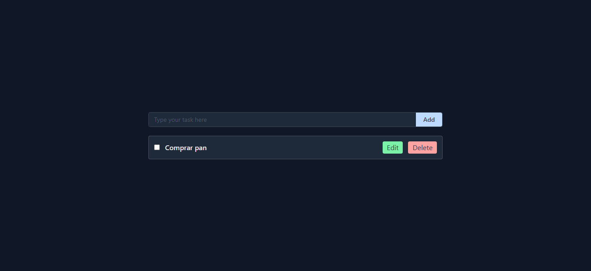
- **limit_1_long**
  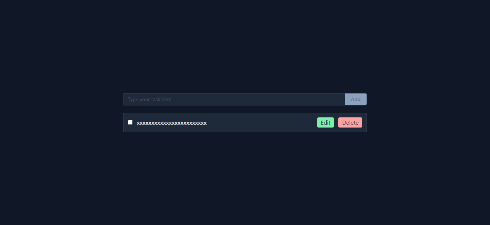
- **negative_1_empty_click**
  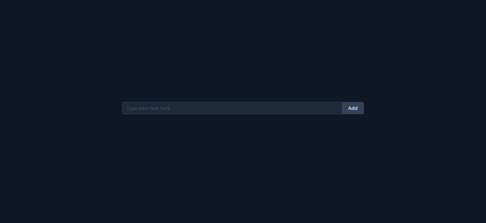

### Editar (Pruebas para la edición de elementos)

- **happy_1_before**
  
- **happy_2_editing**
  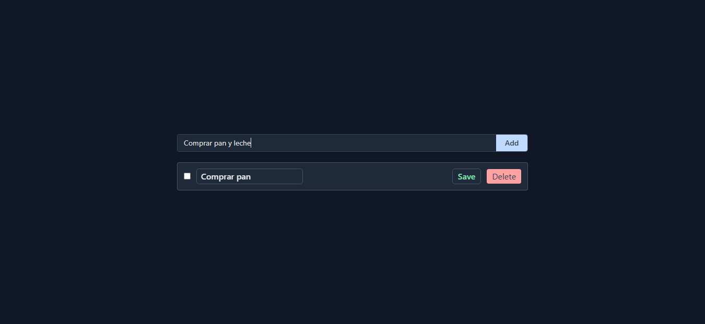
- **limit_1_long**
  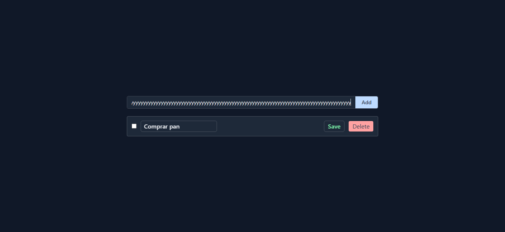
- **negative_1_completed**
  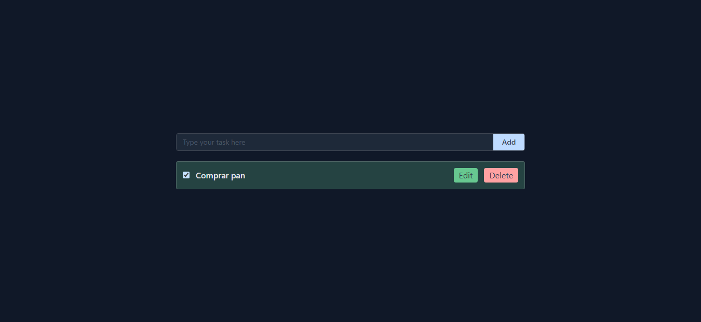

### Eliminar (Pruebas para la eliminación de elementos)

- **happy_1_after_delete**
  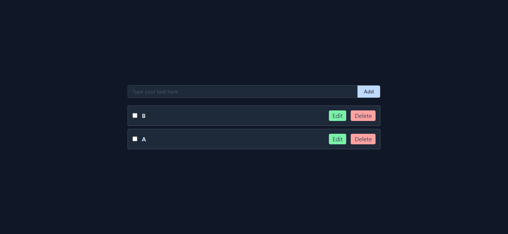
- **limit_1_all_deleted**
  
- **negative_1_remaining**
  

### Persistencia (Pruebas para la persistencia de datos)

- **happy_1_before_refresh**
  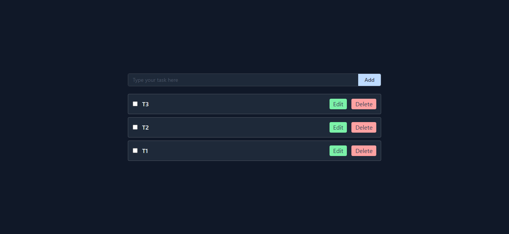
- **limit_1_50_created**
  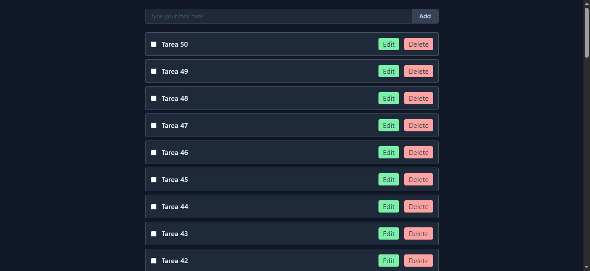
- **negative_1_corrupt**
  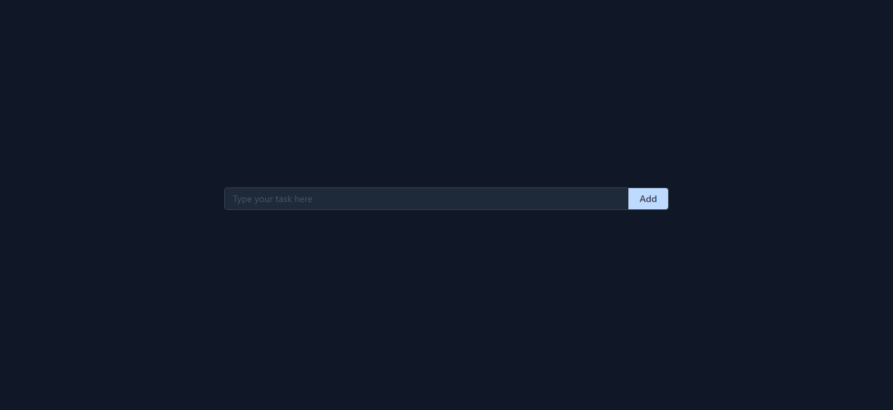

### Toggle (Pruebas para el cambio de estado de elementos)

- **happy_1_completed**
  
- **limit_1_10toggles**
  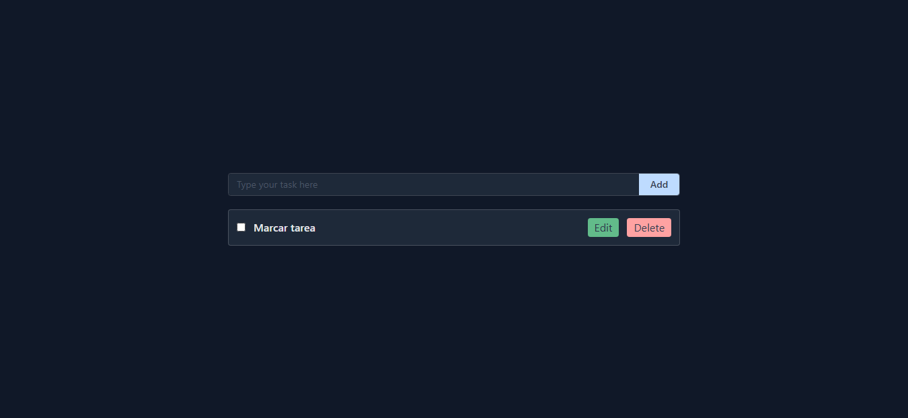
- **negative_1_double**
  
